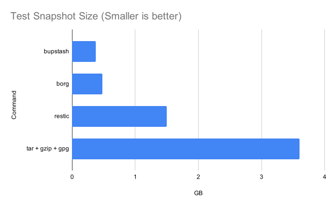
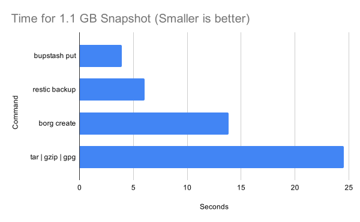
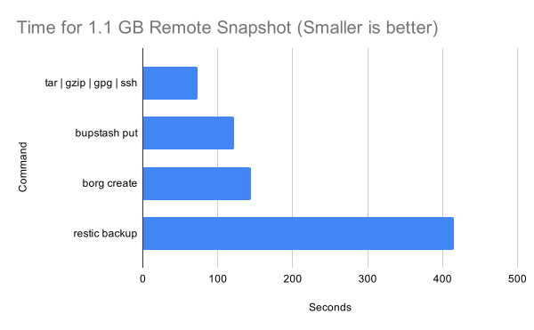
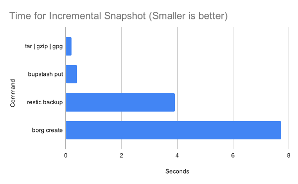
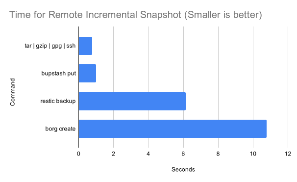
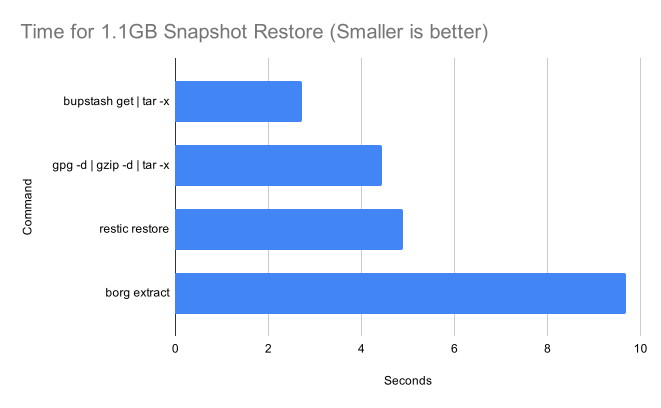
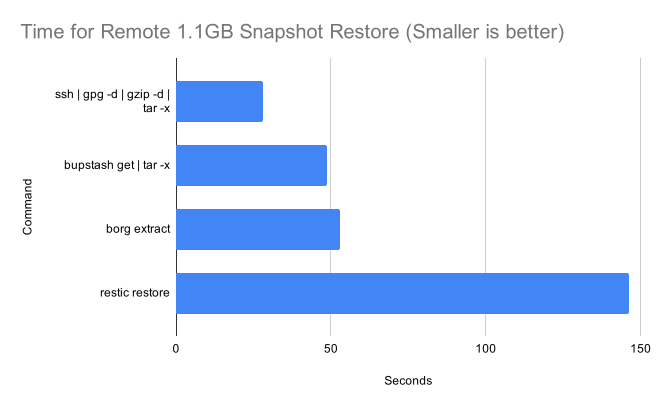
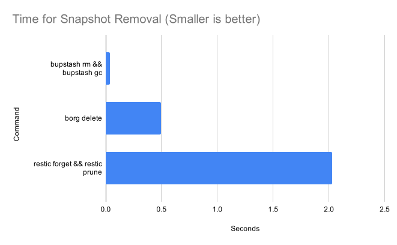
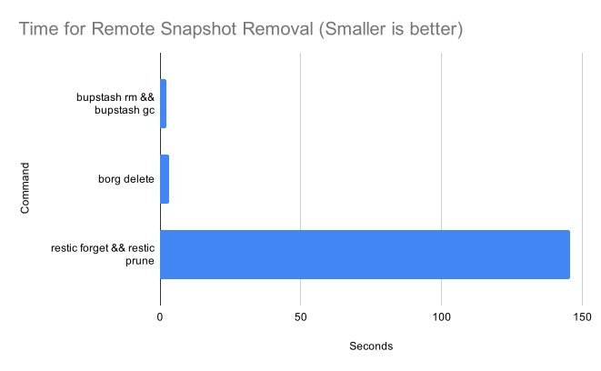
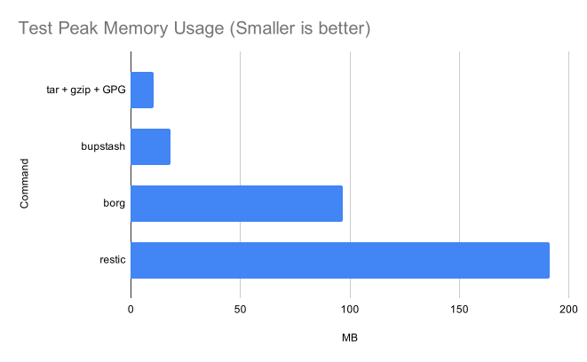

# Encrypted Backup Shootout

Recently I have been spending time on improving the performance of [bupstash](https://github.com/andrewchambers/bupstash) (my encrypted backup tool), and wanted to compare it to some existing tools to try and find its relative performance in the backup tool landscape.

This post compares [bupstash](https://github.com/andrewchambers/bupstash), [restic](https://restic.net/), [borg backup](https://www.borgbackup.org/) and plain old tar + gzip + GPG across a series of simple benchmarks.

What do all these tools have in common?

- They encrypt data at rest.
- They compress data.
- They have some form of incremental and/or deduplicated snapshotting.
- They are all pretty great backup systems.

Feel free to checkout the project websites to learn more, let's get to the benchmarks.

# Benchmarks

For these tests we are using the following versions of the given software:

- GNU tar 1.32 + gzip 1.10 + GPG 2.2.23
- Bupstash 0.6.1
- Borg 1.1.14
- Restic 0.11.0

The test machine has an AMD Ryzen Threadripper 1950X 16-Core Processor with 16 GB of ram, and an NVMe SSD hard drive. It is probably best to simply compare results relatively, as reproducing my test environment exactly would be difficult.

The scripts I used for my benchmarking can be found [here](https://github.com/andrewchambers/EncryptedBackupShootout), though they will definitely need tweaking for your environment.

## Deduplication and compression

For this benchmark we take 20 different consecutive versions of the linux kernel source code and add them all to the same directory, we then create a snapshot and measure the size of the resulting tarball/repository.

The linux kernel versions chosen for this test are all the consecutive git commits preceeding version 5.9, with the resulting directory containing 21 GB of uncompressed files.

|Command|Size|Compression Ratio|
|---|---|---|
|bupstash|0.378 GB|55x|
|borg|0.476 GB|49x|
|restic|1.5 GB|14x|
| tar + gzip + gpg| 3.6 GB|5.8x|

This benchmark shows the advantage the more sophisticated tools have over plain tarballs, They all have extremely good compression ratios when similar data is added multiple times to a backup repository.

## Creating a fresh directory snapshot

For this benchmark we are snapshotting a copy of the linux 5.9.8 source code.

The directory we are snapshotting is 1.1 GB comprised of 74725 files and directories.

The snapshots are all made to tmpfs so hopefully does not measure delays introduced by the network or disk activity.

Raw data (Click to expand)

|Command|Mean Duration|
|---|---|
|bupstash put|3.939 s|
|restic backup|6.026 s|
|borg create|13.831 s|
|tar \| gzip \| gpg| 24.505 s|

Bupstash is the clear winner here for raw snapshotting speed.

## Sending a fresh snapshot to a remote server

This benchmark is the same as the fresh local snapshot benchmark except the files are sent to a remote server hosted on google cloud via ssh. This benchmark should only be considered an approximation of the effect latency has on the tool performance as it is so dependent on network speeds.

At the time of benchmarking my connection to the remote server can be summarized as follows:

- server -> client 10MiB/s
- client -> client 2.5MiB/s
- ping 32 milliseconds

Raw data (Click to expand)

|Command|Mean Duration|
|---|---|
|tar \| gzip \| gpg \| ssh| 72.640 s|
|bupstash put|121.817 s|
|borg create|143.942 s|
|restic backup|414.859 s|

Plain tar takes the win again, Restic performs poorly here, it has a far more latency-sensitive upload protocol.

## Creating an incremental directory snapshot

This benchmark is the same as the fresh local snapshot benchmark, except now we measure the time for an incremental snapshot using the builtin caching mechanism of the tools. What this means is each tool keeps a record of what files it has already sent, and is able to
skip doing that work again.

Raw data (Click to expand)

|Command|Mean Duration|
|---|---|
|tar --listed-incremental \| gzip \| gpg| 0.209 s|
|bupstash put|0.394 s|
|restic backup|3.916 s|
|borg create|7.724 s|

Incremental tar is the clear winner here, but why are the other tools slower? I think this is mainly because the other tools present each snapshot to the user as a full backup and thus do extra work to spare the end user from managing incremental backups manually.

It is also interesting to me that `bupstash put` is an order of magnitude faster than the other similar tools, though I currently can not explain clearly why that may be the case.

## Sending an incremental snapshot to a remote server

This benchmark is the same as the incremental local snapshot benchmark except the files are sent to a remote server hosted on google cloud via ssh.

Benchmark conditions are the same as the fresh remote snapshot benchmark.

Raw data (Click to expand)

|Command|Mean Duration|
|---|---|
|tar --listed-incremental \| gzip \| gpg \| ssh| 0.779 s|
|bupstash put|0.999 s|
|restic backup|6.140 s|
|borg create|10.772 s|

These results match closely with the local incremental snapshots.

## Restoring a snapshot

In this benchmark we will restore the snapshot made in the fresh local snapshot benchmark to tmpfs.

Raw data (Click to expand)

|Command|Mean Duration|
|---|---|
|bupstash get \| tar -x| 2.712 s|
|gpg -d \| gzip -d \| tar -x|4.449 s|
|restic restore|4.890 s|
|borg extract|9.694 s|

Bupstash is the winner for restoring backups.

## Restoring a snapshot from a remote server

In this benchmark we will restore the snapshot made in the fresh remote snapshot benchmark to tmpfs. The main difference from the previous benchmark is the introduction of an internet connection between the backup repository and restore point.

Network conditions are the same as the fresh network snapshot benchmark.

Raw data (Click to expand)

|Command|Mean Duration|
|---|---|
|ssh \| gpg -d \| gzip -d \| tar -x|28.082 s|
|bupstash get \| tar -x|48.893 s|
|borg extract|52.931 s|
|restic restore|146.098 s|

Interestingly, the introduction of the network pushed tar ahead of bupstash for backup restoration - this is something I am very interested in investigating further.

## Pruning an old backup

In this benchmark we will be removing an old snapshot from the backup repository on the same computer. For this test we generate a backup repository with 50 different snapshots of different versions of the linux kernel source code and then time how long it takes to remove one of the snapshots.

Tar with incremental backups does not easily support pruning of old backups, so does not participate in this benchmark.

Raw data (Click to expand)

|Command|Mean Duration|
|---|---|
|bupstash rm && bupstash gc|0.0386 s|
|borg delete|0.497 s|
|restic forget && restic prune|2.030 s|

The bupstash garbage collector is very fast compared to borg and restic, as the creator of bupstash I can say I took special care to optimize this part of bupstash so am quite happy with this result.

## Pruning an old backup on a remote server

In this benchmark we will be removing an old snapshot from the backup repository stored on a remote server. The remote server is the same as the one used in fresh remote snapshot benchmark, and the test data is the same as the local prune bench mark.

Raw data (Click to expand)

|Command|Mean Duration|
|---|---|
|bupstash rm && bupstash gc|2.137 s|
|borg delete|3.111 s|
|restic forget && restic prune|145.540 s|

Once again restic suffers the worst from introduced network latency of all the tools.

## Approximate peak client side ram usage

For this benchmark we repeat the fresh snapshot benchmark, but measure the peak client ram usage (RSS) as reported by the `time` command. For tar we approximate this by summing the peak memory usage across tar, gpg and gzip.

Raw data (Click to expand)

|Command|Peak Memory Usage|
|---|---|
|tar + gzip + GPG|10.312 MB|
|bupstash|18.192 MB|
|borg|96.696 MB|
|restic|191.252 MB|

Bupstash was very memory-efficient compared to restic and borg, but ultimately loses out to the simplicity of tar + gzip + GPG.

# Conclusions and discussion

GNU Tar + gzip + gpg is an excellent encrypted backup option and performed better than I expected. I think tar and gpg is still a great choice for users who prefer to DIY their own backup scripts. With this in mind, we must ask what are the problems with tar that the other tools address? My opinion is that managing incremental backups, deduplication, pruning, and searching backups are far more difficult when using incremental tar compared to borg/restic/bupstash. With incremental tar, it quickly becomes quite hard to track which incremental tarballs depend on each other and you often need to periodically do full snapshots - losing most of the speed benefits.

As the biased author of bupstash, I am also pleased with how it has performed and hope I can push it further in the future. Restic, while fast at local operation, seems to trail the other tools when network latency is thrown into the mix. Borg is an all-around great tool and performed better than I expected.

In conclusion, I can see strengths, weaknesses and room for improvement in all the tools tested, and encourage everyone to give them a try for yourself.

As always, thank you for your time and see you next time :).